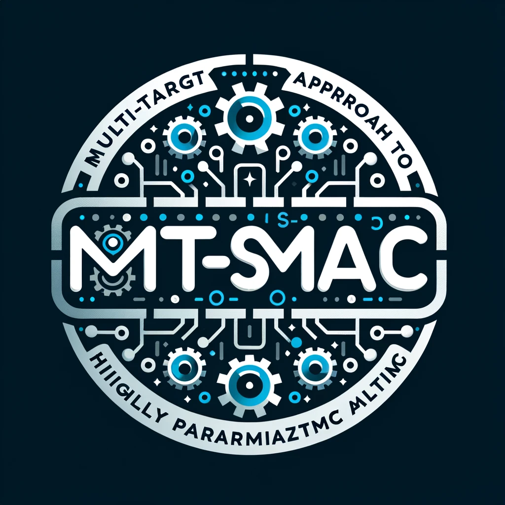
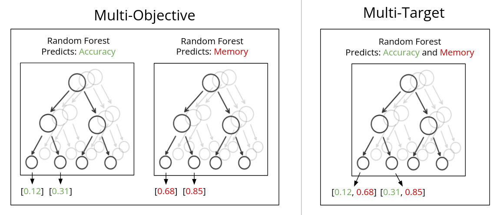

# MT-SMAC: A Novel Multi-Target Approach to Highly Parametrized Algorithms Optimization


<div align="center">
  
</div>

## 💡 Introduction

**MT-SMAC** (Multi-Target Sequential Model-based Algorithm Configuration) is a new approach designed for optimizing highly parametrized algorithms built on top of SMAC. It offers a unique approach to tackling complex optimization problems. MT-SMAC stands out for its ability to handle multiple targets simultaneously, paving the way for more robust and versatile algorithmic solutions.

> [Paper](paper.pdf)

## 🧑‍🏫️ How it works

From the [Paper](paper.pdf):

> This paper investigates the optimization of algorithms with many parameters, a common challenge in areas such as SAT solving, mixed integer programming, AI planning, and machine learning, through Automated Algorithm Configuration (AAC). We compare model-free and model-based AAC methods, with a focus on Sequential Model-Based Optimization (SMBO) and its application in Sequential Model-based Algorithm Configuration (SMAC). We explore multi-objective optimization, analyzing the performance of ParEGO and MO-SMAC. The core contribution of this work is the development of MT-SMAC, a multi-target model using a single surrogate model for all objectives, leveraging a Multi-task Gradient Boosting Machine to achieve a more efficient prediction process by understanding correlations between targets. The paper's empirical section utilizes the YAHPO gym for benchmarking, providing a comparative analysis of the proposed models. Concluding remarks suggest future research directions, including the exploration of Predicted Hypervolume Improvement and the potential of cross-validation to prevent overfitting, aiming to refine the process of algorithm configuration further.


<div align="center">
  
</div>


## 🛠️ Installation

**Python version**: 3.10

```bash
# Create and activate environment:
conda create -n SMAC python=3.10
conda activate SMAC

# Install swig:
conda install gxx_linux-64 gcc_linux-64 swig

# Install SMAC via PyPI:
pip install smac
```

## 🚀 Quick Start

Run notebook [*evaltemplate-yahpo.ipynb*](evaltemplate-yahpo.ipynb)
